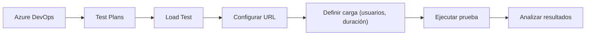

# Tipos de Tests

## Unit Tests

Son pruebas que validan pequeñas unidades de código de manera individual, normalmente funciones o métodos. Se ejecutan muy rápido porque no dependen de sistemas externos.

Ejemplo:  
Probar que una función que suma dos números devuelve el resultado correcto.

## Integration Tests

Comprueban que los distintos componentes del sistema funcionan correctamente cuando se combinan. Validan la comunicación entre módulos.

Ejemplo:  
Probar una función que necesita leer datos de una base de datos simulada.

## API Tests

Validan el comportamiento de las API, normalmente enviando solicitudes HTTP y comprobando las respuestas esperadas. Se centran en entradas, salidas, códigos de estado y validaciones.

Ejemplo:  
Enviar una petición POST a un endpoint de creación de usuario y comprobar que devuelve estado 201.

## Automated UI Tests

Simulan la interacción del usuario con la interfaz gráfica. Son más lentos y frágiles que otros tipos de tests, pero permiten validar flujos completos.

Ejemplo:  
Abrir una aplicación web, hacer clic en "Login", introducir credenciales y verificar que el usuario accede al panel.

## Manual Tests

Pruebas realizadas por una persona siguiendo pasos definidos. Se usan para validar casos complejos, exploratorios o cuando la automatización no es rentable.

Ejemplo:  
Un tester prueba manualmente un formulario nuevo para comprobar si es intuitivo.

## Performance Tests

Evaluan el rendimiento del sistema bajo carga: velocidad, estabilidad, escalabilidad y uso de recursos.

Ejemplo:  
Simular 1000 usuarios accediendo simultáneamente a una API.

---

# Testing Pyramid

La pirámide de test indica la proporción recomendada entre tipos de pruebas para lograr estabilidad y velocidad en el ciclo DevOps. Su idea principal es que **las pruebas más rápidas y baratas deben ser más numerosas**, y las más lentas deben ser menos frecuentes.

Orden desde la base (más cantidad) hasta la cima (menos cantidad):

- Unit Tests
- Integration Tests
- Automated UI Tests
- Manual Tests

Frase clave:  
Los tests son código que valida otro código, y forman parte esencial del proceso DevOps.

---

# Azure Testing

Azure DevOps proporciona herramientas para planificar, organizar y ejecutar pruebas dentro del ciclo de desarrollo.

## Test Cases

Son definiciones detalladas de lo que se debe probar. Incluyen pasos, datos de entrada y resultados esperados.

## Test Suites

Conjunto de test cases organizados por criterio: funcionalidad, requisito, área del sistema, etc.

## Test Plans

Estructura de nivel superior que organiza suites y casos. Permite asignar testers, programar ejecuciones y revisar resultados.

También se pueden seleccionar testers para ejecutar todos los tests dentro de un test suite específico.

---

# Ejecutar un URL Load Test

A continuación un diagrama de flujo en Mermaid compatible con Obsidian 1.12.4:

