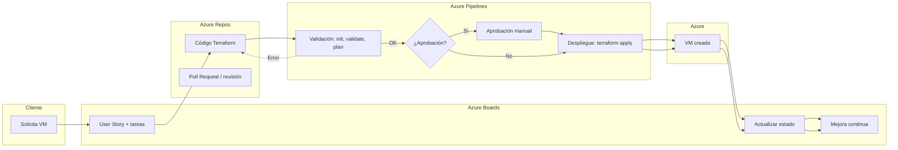

# Ejemplo práctico: Azure DevOps + Terraform + Azure

> En esta nota exploramos **cómo una startup ficticia** usa Azure DevOps para desplegar una máquina virtual en Azure usando Terraform, mostrando cómo se conectan las herramientas entre sí.

---

# 1. Contexto del ejemplo

> **Escenario:**  
> Una pequeña _startup tecnológica_ desarrolla soluciones cloud para clientes.  
> Un cliente solicita una **VM en Azure** para una aplicación interna.  
> El equipo decide automatizar todo el proceso con **Terraform** + **Azure DevOps**.

El flujo combina tres pilares:

-  **Azure Boards** → Organización del trabajo (Scrum).
-  **Azure Repos** → Repositorio Git del código Terraform.
-  **Azure Pipelines** → Automatización del despliegue.

---

# 2. Azure Boards — Organización del trabajo

> Azure Boards es el módulo de **gestión de proyectos ágil** dentro de Azure DevOps.

## ¿Qué se hace aquí?

- Crear una **User Story**:  
    **“Desplegar una VM en Azure con Terraform”**.
- Dividirla en tareas:
    - Crear repositorio y estructura Terraform.
    - Definir variables y módulos.
    - Crear pipeline de validación.
    - Crear pipeline de despliegue.
- Asignar tareas a los desarrolladores.
- Usar el tablero tipo **Kanban**:

```
To Do → Doing → Done
```

## ¿Por qué es útil?

- Aporta **claridad**
- Facilita el **seguimiento**
- Incrementa la **responsabilidad y visibilidad** del trabajo

---

# 3. Azure Repos — Código Terraform versionado

> Azure Repos es el lugar donde vive el **código fuente**, gestionado con Git.

## Estructura típica del repositorio

```
1. /main.tf

2. /variables.tf

3. /outputs.tf

4. /terraform.tfvars

5. /modules/

6. /pipelines/
```

## ¿Qué aporta Repos?

- Versionado Git
- Historial de cambios
- Pull Requests
- Trabajo colaborativo sin conflictos

## Resumen sencillo

> Azure Repos es como una “carpeta compartida con superpoderes”:  
> control de versiones, revisiones, automatización y trazabilidad.

---

# 4. Azure Pipelines — Automatización del despliegue

> Azure Pipelines se encarga de validar y desplegar la infraestructura Terraform.

## Pipelines típicos

### **Pipeline 1 – Validación del código**

Se ejecuta cada vez que alguien hace _push_:

- `terraform init`
- `terraform validate`
- `terraform plan`

Si todo pasa → el código es seguro para continuar.

---

### **Pipeline 2 – Despliegue**

Se ejecuta manualmente o tras una aprobación:

- `terraform apply` → Crea la VM en Azure

---

## ¿Por qué usar pipelines?

- Evitas errores humanos
- Garantizas un código válido antes de desplegar
- Automatizas procesos repetitivos




