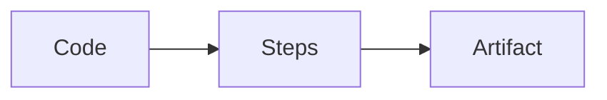
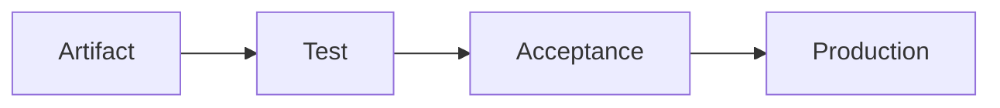
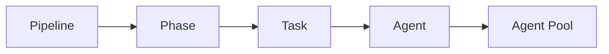
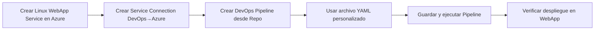
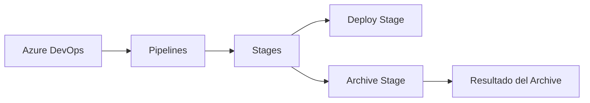
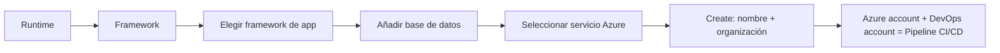

# DevOps Pipelines 101

## CI/CD

**CI/CD** significa **Integración Continua (Continuous Integration)** y **Despliegue Continuo (Continuous Deployment)**.  
Es un conjunto de prácticas que permiten automatizar la construcción, prueba y despliegue de software cada vez que hay cambios en el código.

Una **pipeline** es el lugar donde ocurre CI/CD:

- Construye el código.
- Ejecuta pruebas.
- Genera artefactos.
- Despliega automáticamente.

Puedes conectar tu pipeline a GitHub u otros proveedores Git.

---

## Pipeline

Una **pipeline** ejecuta el proceso de Integración Continua y funciona así:

- Ejecuta tareas cuando envías código (push o pull request).
- Utiliza un **agente de compilación (build agent)**.
- Genera un **artefacto**.

### Ejemplos de artefactos

- Aplicación Java empaquetada en un archivo .zip.
- Librerías en C++ o JavaScript.
- Imágenes de máquina virtual o Docker.

---

## Proceso de despliegue en DevOps

1. Crear una rama.
2. Crear un Pull Request.
3. Hacer merge.
4. Construir con un Build Agent.

---

## Build Agent

Un **build agent** es una máquina (física o virtual) que:

- Compila, prueba y despliega el código.
- Ejecuta las tareas definidas en la pipeline.
- Da confianza al desarrollador de que el build es estable.
- Permite identificar el commit que produjo un error.

---

## Builds vs Releases

### Build Pipeline

Una pipeline de build genera el artefacto.



### Release Pipeline

Una pipeline de release toma el artefacto y lo promueve entre entornos.



---

## Agents, Phases y Tasks

Una pipeline contiene fases y cada fase contiene tareas. Las tareas se asignan a agentes dentro de un pool.



---

## Crear una Build Pipeline en Azure DevOps

Ruta:

- Pipelines → New Pipeline
- Connect → Where is your code?
- Seleccionar repositorio
- Configure
    - Starter pipeline
    - Azure Pipelines YAML existente
    - Otras opciones
- Review → Guardar y ejecutar

### YAML

YAML es un formato de serialización de datos legible por humanos. Permite expresar configuración como código.

**Serialización:** proceso de convertir estructuras de datos en un formato que puede almacenarse o reconstituirse en otro entorno.

---

## Crear una Pipeline de GitHub

Ruta:

- GitHub Marketplace → Azure Pipelines
- Create new pipeline → Connect → Select → Configure → Review
- O bien Import build pipeline para cargar un archivo JSON de pipeline.

---

## Crear una Release Pipeline en DevOps

Considera siempre: **Qué**, **Dónde**, **Quién**.

### Stages

- Elegir plantilla.
- Asignar nombre.
- Definir parámetros.

### Parámetros típicos

- Azure Subscription
- App service name
- Startup command

### Artefactos

- Source type
- Project
- Source (build pipeline)

---

# Troubleshooting real de una Pipeline

## Procedimiento



### 1. Crear un Linux WebApp Service

Usar el repositorio clonado:

https://github.com/likeabosslearning/Flatris-LAB

### 2. Crear un Service Connection

Conecta Azure DevOps a tu suscripción Azure. El nombre se usará en el YAML.

### 3. Crear la DevOps Pipeline

Seleccionar el repositorio en Azure DevOps.  
Elegir la opción “Node.js” para empezar.

### 4. Usar este archivo YAML (sustituye tus valores)

```
# Node.js Express Web App to Linux on Azure
trigger:
- master

variables:
  azureSubscription: 'ServiceConnectionName'
  webAppName: 'LinuxApp5601'
  resourceGroupName: 'Linux5601RG'
  environmentName: 'LinuxApp5601'
  vmImageName: 'ubuntu-latest'

stages:
- stage: Archive
  displayName: Archive stage
  jobs:
    - job: Archive
      displayName: Archive
      pool:
        vmImage: $(vmImageName)
      steps:
        - task: AzureAppServiceSettings@1
          inputs:
            azureSubscription: $(azureSubscription)
            appName: $(webAppName)
            resourceGroupName: $(resourceGroupName)
            appSettings: |
              [
                {
                  "name": "SCM_DO_BUILD_DURING_DEPLOYMENT",
                  "value": "true"
                }
              ]
        - task: ArchiveFiles@2
          displayName: Archive files
          inputs:
            rootFolderOrFile: '$(System.DefaultWorkingDirectory)'
            includeRootFolder: false
            archiveType: zip
            archiveFile: $(Build.ArtifactStagingDirectory)/$(Build.BuildId).zip
            replaceExistingArchive: true
        - upload: $(Build.ArtifactStagingDirectory)/$(Build.BuildId).zip
          artifact: drop

- stage: Deploy
  displayName: Deploy stage
  dependsOn: Archive
  condition: succeeded()
  jobs:
    - deployment: Deploy
      displayName: Deploy
      environment: $(environmentName)
      pool:
        vmImage: $(vmImageName)
      strategy:
        runOnce:
          deploy:
            steps:
              - task: AzureWebApp@1
                displayName: Azure Web App Deploy
                inputs:
                  azureSubscription: $(azureSubscription)
                  appType: webAppLinux
                  appName: $(webAppName)
                  runtimeStack: 'NODE|10.14'
                  package: $(Pipeline.Workspace)/drop/$(Build.BuildId).zip
```

### 5. Guardar y ejecutar la pipeline

Luego abrir la URL del WebApp.

---

## Verificar resultados del despliegue



---

## Despliegue automático con YAML

El objetivo es mostrar lo fácil que puede ser un despliegue completamente automatizado con CI/CD.

---

# Comenzar en DevOps usando una Pipeline CI/CD

## DevOps Projects



---

# Crear una Deployment Pipeline desde el IDE

## Extensiones útiles

- Azure Account
- Azure App Service
- Azure CLI Tools
- Azure Pipelines
- Azure Repos
- YAML

## Comandos necesarios para Node.js

```
npm install
npm build
npm start
```